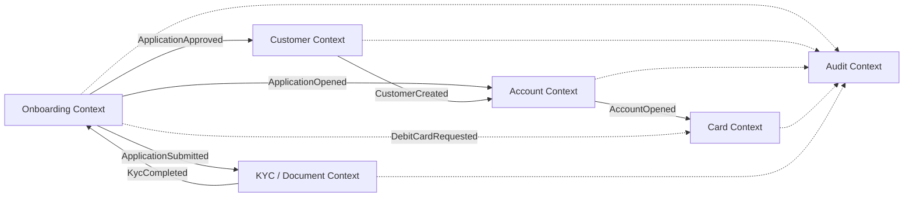
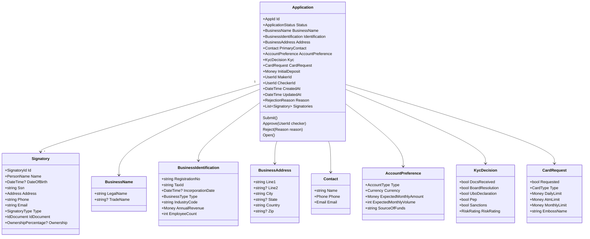
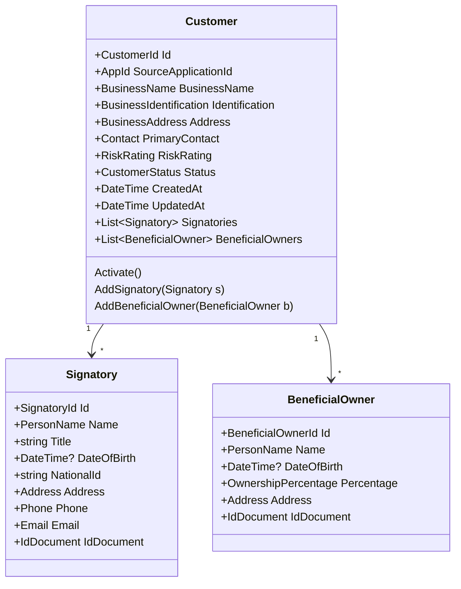
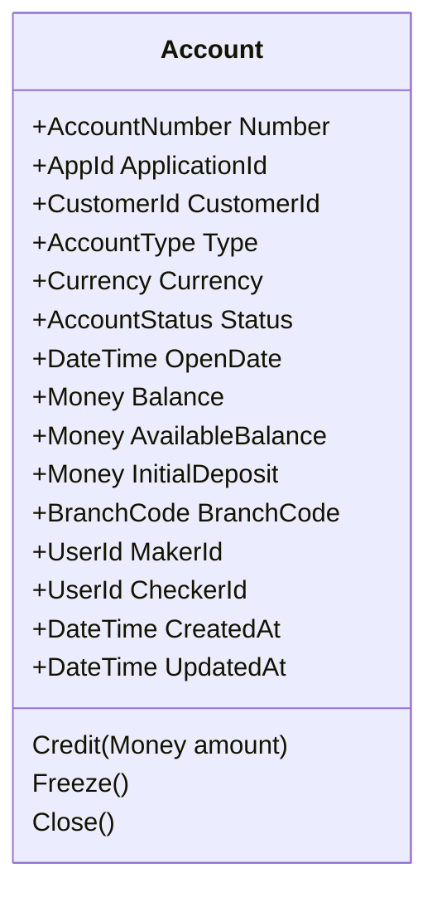
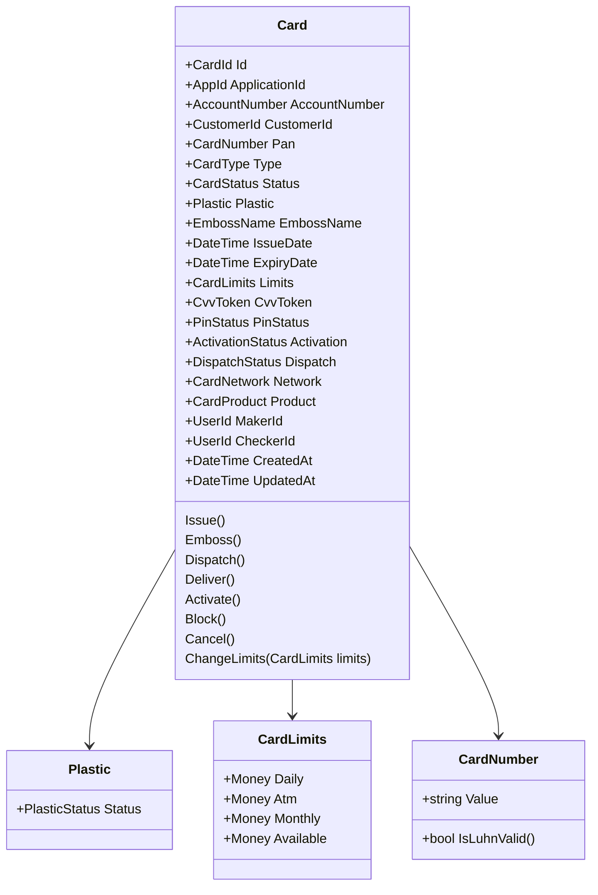
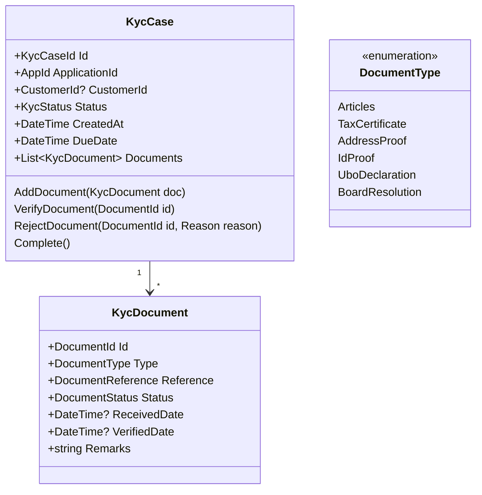
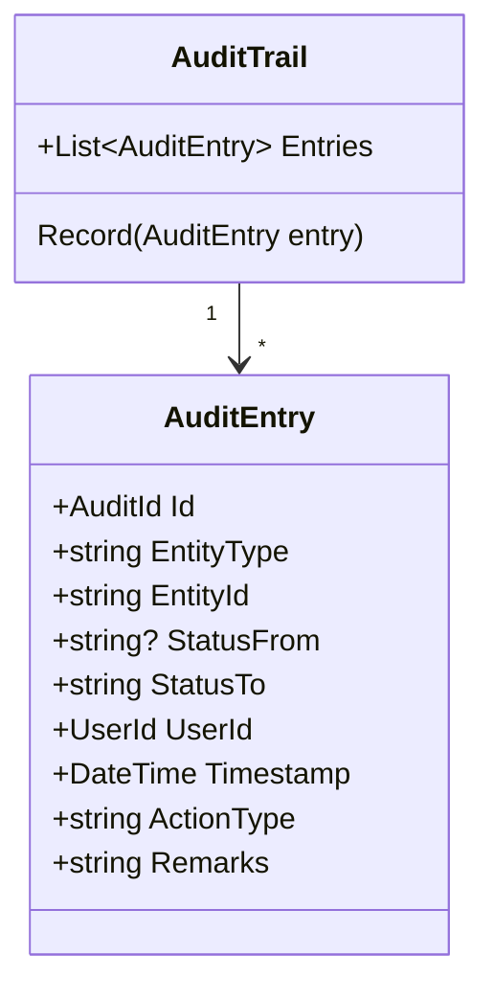

# Domain Model - Modern Platform Mapping

A domain-driven design (DDD) translation of the mainframe business-banking account-opening system for a modern React / .NET / MongoDB stack.

Source artifacts used:

- `COPYBOOK/CPYBAC00.cpy` - `CPYBAC07.cpy`
- `COBOL/CICS/BACONL01.cbl` (transaction `BA01`)
- `COBOL/BATCH/BACBAT01.cbl`
- `BMS/BACMAPS.bms`
- `DB2/DDL/*.sql`
- `DOC/BUSINESS_RULE_CATALOG.md`

---

## 1. Domain overview

The system supports the end-to-end creation of a business bank account, from an online application wizard through compliance checks, customer and account creation, and optional debit card issuance.

Core domain concepts:

- **Onboarding** - capture and validate a business-account application.
- **Customer** - the legal business entity and its representatives.
- **Account** - the opened bank account product.
- **Card** - the linked debit/prepaid card and its plastic lifecycle.
- **KYC / Document** - compliance document collection and verification.
- **Audit** - immutable record of every status change and decision.

---

## 2. Bounded contexts



| Bounded context | Responsibility | Replaces / maps from mainframe |
|-----------------|----------------|--------------------------------|
| **Onboarding** | Multi-step application capture, validation, decision, status workflow | `BACONL01` CICS program, `BACMAPS` screens, `TB_BAC_APPLICATION` |
| **Customer** | Legal entity master, authorized signatories, beneficial owners, risk profile | `TB_BAC_CUSTOMER`, `TB_BAC_SIGNATORY`, `CPYBAC02/03` |
| **Account** | Opened account product, account number, balances, status | `TB_BAC_ACCOUNT`, `CPYBAC04` |
| **Card** | Card issuance, PAN, plastic lifecycle, limits, activation | `TB_BAC_CARD`, `CPYBAC07` |
| **KYC / Document** | Document checklist, verification, PEP/sanctions results | `TB_BAC_DOCUMENT`, `CPYBAC05`, page-3 KYC flags |
| **Audit** | Append-only status transition log | `TB_BAC_AUDIT`, `CPYBAC06` |

Integration style: **domain events published over an async message bus** (e.g., MassTransit + RabbitMQ/Azure Service Bus). Each context owns its own MongoDB database/collection and exposes a public API; direct cross-context database access is forbidden.

---

## 3. Context map - relationships

| Upstream context | Downstream context | Integration event |
|------------------|--------------------|-------------------|
| Onboarding | KYC / Document | `ApplicationSubmitted` |
| KYC / Document | Onboarding | `KycCompleted` / `KycFailed` |
| Onboarding | Customer | `ApplicationApproved` |
| Onboarding | Account | `ApplicationOpened` |
| Customer | Account | `CustomerCreated` |
| Account | Card | `AccountOpened` |
| Onboarding | Card | `DebitCardRequested` |
| All contexts | Audit | All domain events consumed |

---

## 4. Aggregates, entities, value objects, and lifecycle states

### 4.1 Onboarding context

#### Aggregate root: `Application`



**Entities**

- `Application` (aggregate root)
- `Signatory` (child entity - has identity within the application)

**Value objects**

- `BusinessName`, `BusinessIdentification`, `BusinessAddress`, `Contact`, `Phone`, `Email`, `Money`, `Currency`, `AccountPreference`, `KycDecision`, `CardRequest`, `RiskRating`, `BusinessType`, `AccountType`, `CardType`, `SignatoryType`, `IdDocument`, `OwnershipPercentage`, `RejectionReason`, `UserId`, `AppId`

**Lifecycle states**

| State | Meaning | Transition triggers |
|-------|---------|-------------------|
| `Draft` | Application started but not submitted | Created from wizard |
| `Submitted` | All required pages valid and submitted | `Submit()` command |
| `KycPending` | Awaiting document verification | KYC document decision (legacy value; kept for data compatibility) |
| `Pending` | Under review / waiting for checker | Future workflow state |
| `Approved` | Checker approved | `Approve(checker)` command |
| `Rejected` | PEP/sanctions hit or checker rejected | `Reject(reason)` command |
| `Opened` | Account and customer created by batch / account service | `ApplicationOpened` event consumed |

**Important invariants**

- `LegalName`, `TaxId`, and `RegistrationNo` are required.
- `BusinessType` must be one of `LLC`, `Corporation`, `Partnership`, `SoleProprietor`, `NonProfit`, `Trust`.
- `Address.Line1`, `City`, and `Country` are required.
- If `Country` is `USA` or `US`, `State` and `Zip` are required.
- `AccountType` must be `Checking`, `Savings`, `MoneyMarket`, or `TermDeposit`.
- `RiskRating` must be `Low`, `Medium`, or `High`.
- `InitialDeposit` must be >= 0.
- If `Pep` or `Sanctions` is true, the application must transition to `Rejected` and must not be opened.
- All KYC document flags must be true before `Approved` can be reached.
- `Signatory.Name`, `DateOfBirth`, and `Type` are required.
- `Signatory.Type` must be `Authorized` or `BeneficialOwner`.
- `CardRequest.Requested` is only allowed when the application is not rejected.
- `CardRequest` limits must be >= 0.
- An application in `Opened` must have a non-null `AccountNumber` populated by the Account context.

**Domain events**

- `ApplicationCreated`
- `ApplicationSubmitted`
- `ApplicationKycPending`
- `ApplicationApproved`
- `ApplicationRejected`
- `ApplicationOpened`
- `DebitCardRequested`
- `SignatoryAdded`

---

### 4.2 Customer context

#### Aggregate root: `Customer`



**Entities**

- `Customer` (aggregate root)
- `Signatory` (child entity)
- `BeneficialOwner` (child entity)

**Value objects**

- `BusinessName`, `BusinessIdentification`, `BusinessAddress`, `Contact`, `Phone`, `Email`, `Address`, `PersonName`, `IdDocument`, `OwnershipPercentage`, `RiskRating`, `CustomerStatus`, `CustomerId`, `AppId`

**Lifecycle states**

| State | Meaning |
|-------|---------|
| `Prospect` | Created from an approved application, not yet active |
| `Active` | Customer is open for business |
| `Dormant` | No activity for a defined period |
| `Closed` | Customer relationship ended |

**Invariants**

- `Customer` must be linked to exactly one `Application`.
- `TaxId` must be unique across customers.
- A business customer must have at least one active `Signatory`.
- Sum of `BeneficialOwner.OwnershipPercentage` must not exceed 100%.
- `Signatory` and `BeneficialOwner` must have valid identity documents.

**Domain events**

- `CustomerCreated`
- `CustomerActivated`
- `SignatoryAdded`
- `BeneficialOwnerAdded`
- `CustomerRiskRatingChanged`
- `CustomerClosed`

---

### 4.3 Account context

#### Aggregate root: `Account`



**Entities**

- `Account` (aggregate root)

**Value objects**

- `AccountNumber`, `AccountType`, `Currency`, `Money`, `AccountStatus`, `BranchCode`, `UserId`, `CustomerId`, `AppId`

**Lifecycle states**

| State | Meaning |
|-------|---------|
| `Pending` | Created but not yet active |
| `Active` | Available for transactions |
| `Frozen` | Temporarily blocked |
| `Closed` | Permanently closed |

**Invariants**

- `AccountNumber` is 12 digits, unique, and passes the Luhn-style check digit.
- `Account` must reference exactly one `Customer` and one `Application`.
- `InitialDeposit` >= 0.
- `Balance` >= `AvailableBalance`.
- `AccountType` and `Currency` are from the allowed domain.

**Domain events**

- `AccountOpened`
- `AccountActivated`
- `AccountFrozen`
- `AccountClosed`
- `InitialDepositCredited`

---

### 4.4 Card context

#### Aggregate root: `Card`



**Entities**

- `Card` (aggregate root)

**Value objects**

- `CardNumber` (PAN, 16 digits, Luhn-valid), `CardType`, `CardStatus`, `Plastic`, `PlasticStatus`, `EmbossName`, `CardLimits`, `CvvToken`, `PinStatus`, `ActivationStatus`, `DispatchStatus`, `CardNetwork`, `CardProduct`, `ExpiryDate`, `CardId`, `AccountNumber`, `CustomerId`, `AppId`, `UserId`

**Lifecycle states - card**

| State | Meaning |
|-------|---------|
| `Requested` | Application requested a card |
| `Approved` | Card issuance approved |
| `Issued` | PAN generated, record created |
| `Activated` | Customer activated the card |
| `Blocked` | Temporarily blocked |
| `Cancelled` | Permanently cancelled |

**Lifecycle states - plastic**

| State | Meaning |
|-------|---------|
| `Pending` | Awaiting embossing |
| `Embossed` | Physical card produced |
| `Dispatched` | Sent to customer |
| `Delivered` | Received by customer |
| `Damaged` | Returned / damaged |

**Invariants**

- `Card` must be linked to an `Account` and `Customer`.
- `CardNumber` must be 16 digits, Luhn-valid, and unique.
- `ExpiryDate` must be in the future at issue time.
- All limits >= 0.
- `AvailableLimit` <= `DailyLimit` and <= `MonthlyLimit`.
- Plastic can be `Dispatched` only after `Embossed`.
- Card can be `Activated` only after plastic `Delivered`.
- CVV and PIN are generated by an HSM and stored as tokens, never persisted in plain text.

**Domain events**

- `CardRequested`
- `CardIssued`
- `CardPlasticEmbossed`
- `CardDispatched`
- `CardDelivered`
- `CardActivated`
- `CardBlocked`
- `CardCancelled`
- `CardLimitChanged`

---

### 4.5 KYC / Document context

#### Aggregate root: `KycCase`



**Entities**

- `KycCase` (aggregate root)
- `KycDocument` (child entity)

**Value objects**

- `DocumentType`, `DocumentReference`, `DocumentStatus`, `KycStatus`, `Reason`, `KycCaseId`, `AppId`, `CustomerId`, `DocumentId`

**Lifecycle states**

| State | Meaning |
|-------|---------|
| `NotStarted` | Case created, no documents requested |
| `DocumentsRequested` | Checklist issued to applicant |
| `InReview` | Some documents received, under review |
| `Approved` | All required documents verified |
| `Rejected` | Missing or fraudulent documents |

**Invariants**

- `KycCase` must be linked to an `Application`.
- Required document types (`Articles`, `TaxCertificate`, `AddressProof`, `IdProof`, `UboDeclaration`, `BoardResolution`) must be received and verified before `Approved`.
- If `KycCase` is `Rejected`, the linked `Application` cannot be `Approved`.

**Domain events**

- `KycCaseCreated`
- `DocumentReceived`
- `DocumentVerified`
- `DocumentRejected`
- `KycCompleted`
- `KycFailed`

---

### 4.6 Audit context

#### Aggregate root: `AuditTrail`



**Entities**

- `AuditTrail` (aggregate root)
- `AuditEntry` (child entity)

**Value objects**

- `AuditId`, `StatusTransition`, `UserId`, `ActionType`, `EntityType`, `EntityId`, `Timestamp`, `Remarks`

**Invariants**

- Append-only; `AuditEntry` records are never mutated.
- Every material state change in the other bounded contexts produces an `AuditEntry`.

**No domain events published** - the Audit context consumes events from all other contexts.

---

## 5. Status transition reference

### Application

```
Draft ──submit──> Submitted ──kyc incomplete──> KycPending ──kyc done──> Submitted ──approve──> Approved ──open──> Opened
                                      │                              │
                                      │                              └── reject ──> Rejected
                                      └────────────────────────────── reject ──> Rejected
Submitted ── direct reject (PEP/sanctions) ──> Rejected
```

### Card

```
Requested ──approve──> Approved ──issue──> Issued ──emboss──> Plastic:Embossed ──dispatch──> Dispatched ──deliver──> Delivered ──activate──> Activated
                                                                                              │
                                                                                              └── damaged ──> Plastic:Damaged
Activated ──block──> Blocked
Any non-Cancelled ──cancel──> Cancelled
```

### Account

```
Pending ──activate──> Active ──freeze──> Frozen ──unfreeze──> Active
Active ──close──> Closed
```

### Customer

```
Prospect ──activate──> Active ──dormant──> Dormant ──reactivate──> Active
Active ──close──> Closed
```

---

## 6. Modern platform architecture

### 6.1 React micro-frontends

| Micro-frontend | Replaces mainframe | Key screens / features |
|-----------------|--------------------|--------------------------|
| `onboarding-ui` | `BACONL01` + `BACMAPS` | Multi-step wizard (business identification, address, product/KYC, signatories, review, confirmation), dashboard menu |
| `customer-ui` | Customer inquiry | View/edit business profile, signatories, beneficial owners |
| `account-ui` | Opened account inquiry | Account dashboard, balances, status |
| `card-ui` | Card summary | Card list, PAN mask, limits, activation, plastic status |
| `kyc-ui` | Document checklist | Upload documents, verification status, PEP/sanctions result display |
| `audit-ui` | Audit trail read | Status history, filter by application/customer |
| `portal-shell` | `BACMENU` | Top-level navigation and SSO wrapper |

**Suggested integration**

- Single-page application (SPA) with module federation, or
- Independent micro-frontends served behind an API gateway / reverse proxy.
- Shared design system and authentication.

### 6.2 .NET microservices

| Service | Context | Responsibility | Key dependencies |
|---------|---------|--------------|------------------|
| `Onboarding.API` | Onboarding | Application wizard, validation, workflow, decision logic | MongoDB, message bus, KYC service client |
| `Customer.API` | Customer | Customer master, signatories, beneficial owners | MongoDB, message bus |
| `Account.API` | Account | Account opening, account number generation, balances | MongoDB, message bus |
| `Card.API` | Card | PAN generation, card issuance, plastic lifecycle | MongoDB, message bus, HSM/PIN vault |
| `Kyc.API` | KYC / Document | Document checklist, PEP/sanctions screening | MongoDB, message bus, external screening APIs |
| `Audit.API` | Audit | Event consumer + read API for status history | MongoDB, message bus |
| `Gateway.API` | Cross-cutting | BFF for React, routing, auth | All APIs |

**Implementation notes**

- Use **MediatR** for commands/queries and **FluentValidation** for input rules.
- Use **MassTransit** or **NServiceBus** with RabbitMQ/Azure Service Bus for domain events.
- Implement an **outbox pattern** in each service so MongoDB writes and event publishing are atomic.
- Use **JWT/OAuth2** authentication; map `sub` claim to `UserId` (replacing `EIBUSERID`).

### 6.3 MongoDB collections

One database per bounded context is recommended. Example collection layout:

| Context | Database | Collections |
|---------|----------|-------------|
| Onboarding | `onboarding-db` | `Applications` |
| Customer | `customer-db` | `Customers`, `Signatories` |
| Account | `account-db` | `Accounts` |
| Card | `card-db` | `Cards` |
| KYC | `kyc-db` | `KycCases`, `Documents` |
| Audit | `audit-db` | `AuditEntries` |

**Mapping from mainframe tables**

| Mainframe table | MongoDB collection | Notes |
|-------------------|----------------------|-------|
| `TB_BAC_APPLICATION` | `onboarding-db.Applications` | Embed `Signatories` if small and bounded; otherwise link to `customer-db.Signatories` |
| `TB_BAC_CUSTOMER` | `customer-db.Customers` | Business profile, risk rating, status |
| `TB_BAC_SIGNATORY` | `customer-db.Signatories` | One per business customer, with `ApplicationId` link |
| `TB_BAC_ACCOUNT` | `account-db.Accounts` | Account number as string index with unique constraint |
| `TB_BAC_CARD` | `card-db.Cards` | Never persist plaintext CVV; store HSM token reference |
| `TB_BAC_DOCUMENT` | `kyc-db.Documents` | Metadata + blob storage URL; `KycCases` aggregate |
| `TB_BAC_AUDIT` | `audit-db.AuditEntries` | Append-only, time-series friendly |

### 6.4 Mainframe-to-modern field mapping highlights

| Mainfield | Modern value object | Notes |
|-----------|---------------------|-------|
| `APP_ID` | `AppId` | Surrogate string ID |
| `BUSINESS_NAME`, `TRADE_NAME` | `BusinessName` | Embedded in `Application` and `Customer` |
| `TAX_ID` / `REGISTRATION_NO` | `BusinessIdentification` | Enforce uniqueness at customer level |
| `BUSINESS_TYPE` (`LC/CP/PT/SP/NP/TR`) | `BusinessType` enumeration | `LC` -> `LLC`, `CP` -> `Corporation`, etc. |
| `ACCOUNT_TYPE` (`CH/SV/MM/TD`) | `AccountType` enumeration | `CH` -> `Checking`, etc. |
| `RISK_RATING` (`LO/MD/HI`) | `RiskRating` enumeration | `LO` -> `Low`, etc. |
| `CARD_TYPE` (`DC/CC/PC`) | `CardType` enumeration | `DC` -> `Debit`, etc. |
| `PEP_FLAG` / `SANCTIONS_FLAG` | `KycDecision` | Moved to KYC context |
| `DOCS_RECEIVED` / `BOARD_RESOLUTION` / `UBO_DECLARATION` | `KycCase` + `KycDocument` | Promoted from single-char flags to document records |
| `ACCOUNT_NUMBER` | `AccountNumber` value object | 12-digit string with check-digit validation |
| `CARD_NUMBER` | `CardNumber` value object | 16-digit PAN with Luhn validation |
| `MAKER_ID` / `CHECKER_ID` | `UserId` | Replace with OIDC claims |
| `CREATED_TIMESTAMP` / `UPDATED_TIMESTAMP` | `DateTime` UTC | `CreatedAt` / `UpdatedAt` |

---

## 7. Event schema examples

### `ApplicationSubmitted` event

```json
{
  "eventType": "ApplicationSubmitted",
  "aggregateId": "APP0000004",
  "occurredAt": "2026-07-14T10:30:00Z",
  "payload": {
    "applicationId": "APP0000004",
    "businessName": "Riverfront Tech Inc",
    "riskRating": "Medium",
    "cardRequested": true,
    "cardType": "Debit"
  }
}
```

### `ApplicationOpened` event

```json
{
  "eventType": "ApplicationOpened",
  "aggregateId": "APP0000004",
  "occurredAt": "2026-07-14T11:00:00Z",
  "payload": {
    "applicationId": "APP0000004",
    "accountNumber": "000101000032",
    "customerId": "CUST000003"
  }
}
```

### `CardIssued` event

```json
{
  "eventType": "CardIssued",
  "aggregateId": "CARD003",
  "occurredAt": "2026-07-14T11:00:01Z",
  "payload": {
    "cardId": "CARD003",
    "applicationId": "APP0000004",
    "accountNumber": "000101000032",
    "customerId": "CUST000003",
    "cardNumberLastFour": "0034",
    "cardType": "Debit",
    "dailyLimit": 2500.00,
    "expiryDate": "2029-07-14"
  }
}
```

---

## 8. Migration considerations

1. **Data migration**
   - Extract `TB_BAC_APPLICATION` rows and transform domain codes to enumerations.
   - Rebuild document flags into `KycCase` + `KycDocument` documents.
   - Generate true `Customer` and `BeneficialOwner` records from single signatory rows.
   - Validate existing `ACCOUNT_NUMBER` and `CARD_NUMBER` values against check-digit rules.

2. **Process migration**
   - Replace CICS pseudo-conversation state with React wizard state and API session.
   - Replace nightly `BACBAT01` batch with real-time `ApplicationOpened` event handlers in Account/Card contexts.
   - Optionally keep a reconciliation batch for bulk reporting and end-of-day balancing.

3. **Security migration**
   - Decommission hard-coded `CVV='123'` and `PIN_STATUS='M'` logic.
   - Integrate HSM for PAN/CVV/PIN generation and a secure token vault.
   - Move PEP/sanctions checks from manual Y/N flags to real-time API screening with case management.

4. **Testing**
   - Maintain the `LOCAL/` GnuCOBOL scenarios as regression baselines while building .NET equivalents.
   - Add unit tests for each aggregate invariant and integration tests for cross-context event flows.
